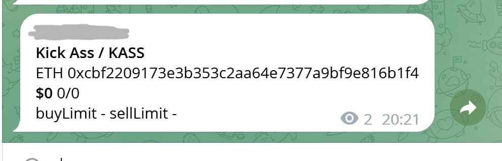

<!-- ABOUT THE PROJECT -->
## About The Project

It is a small utility that takes as input a key from the Redis with contract address.
After checking you will get output to telegram, log, console and Redis. There are will be:
- name / symbol
- second token from pair
- liquidity
- buy/sell taxes and limits
- check on honeypot and proxy calls another contracts
- other useful information

For telegram here is an short set of information depending on the result of the checking:



### Built With

- node.js
- ts-node
- typescript
- axios
- ioredis
- telegraf
- winston

<!-- GETTING STARTED -->
## Getting Started

### Installation

1. Clone the repo
   ```sh
   git clone https://github.com/ziaq/get-token-specifications-etherium.git
   ```
3. Install NPM packages
   ```sh
   npm install
   ```
4. Enter your settings in `config.ts`
   ```js
   export default {
    redisHost: 'localhost',
    redisPort: 6379,
    telegramBotToken: '34543545:sakjdhkHSAKdjhsdsdhaldasdasassffg',
    telegramChatId: '-43534656546',
  };
   ```

<!-- USAGE EXAMPLES -->
## Usage

1. Run in the terminal while in the project directory 
   ```sh
   npm start
   ```
2. Add to Redis db0 new writing with key contains address like "0xD3DDCAbb014Dd54135D3De49800aAbeFc324CAD1"
3. Then you will get output in telegram, console, app.log and db1 in Redis

## Contact

- Twitter https://twitter.com/RomaZiaq
- Telegram @roma_ziaq
- Project Link: https://github.com/ziaq/get-token-specifications-etherium