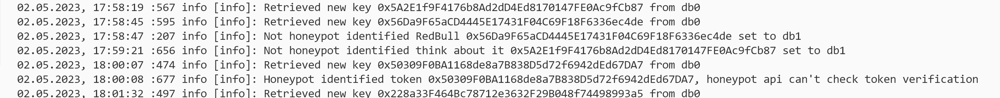

<!-- ABOUT THE PROJECT -->
## About The Project

It is a small utility that takes as input a key from the Redis db0 with contract address.
After checking you will get output to log, console and Redis db1. Output to log and console:
   ```sh
   02.05.2023, 18:33:06 :423 info [info]: Retrieved new key 0xCbA3992231CE5b7cc17c07a0C5B440b64f745F55 from db0
   02.05.2023, 18:33:07 :548 info [info]: Honeypot identified token 0xCbA3992231CE5b7cc17c07a0C5B440b64f745F55, honeypotReason HONEYPOT: EXTREMELY HIGH TAXES
   ```

Also if it is not a Honeypot, a new key with the token address and the value 'notAHoneypot' will be set in Redis db1.



### Built With

- ts-node
- typescript
- axios
- ioredis
- telegraf
- winston
- winston-daily-rotate-file

<!-- GETTING STARTED -->
## Getting Started

### Installation

1. Clone the repo
   ```sh
   git clone https://github.com/ziaq/get-token-specifications-etherium.git
   ```
3. Install NPM packages
   ```sh
   npm install
   ```
4. Enter your settings in `config.ts`
   ```ts
   export default {
    redisHost: 'localhost',
    redisPort: 6379,
    telegramBotToken: '34543545:sakjdhkHSAKdjhsdsdhaldasdasassffg',
    telegramChatId: '-43534656546',
   };
   ```
5. Run Redis, set setting
   ```sh
   notify-keyspace-events ExA
   ```  
<!-- USAGE EXAMPLES -->
## Usage

1. Run in the terminal while in the project directory 
   ```sh
   npm start
   ```
2. Add to Redis db0 new key with address like "0xD3DDCAbb014Dd54135D3De49800aAbeFc324CAD1", value is empty
3. Then you will get output in log, console and Redis db1

## Contact

- Twitter https://twitter.com/RomaZiaq
- Telegram @roma_ziaq
- Project Link: https://github.com/ziaq/get-token-specifications-etherium